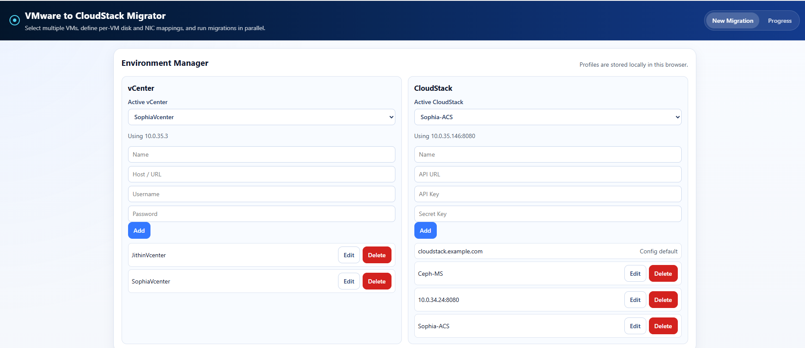
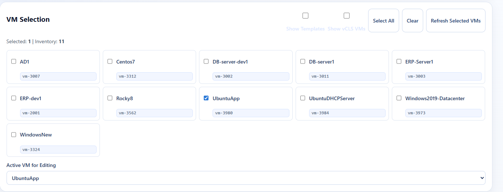
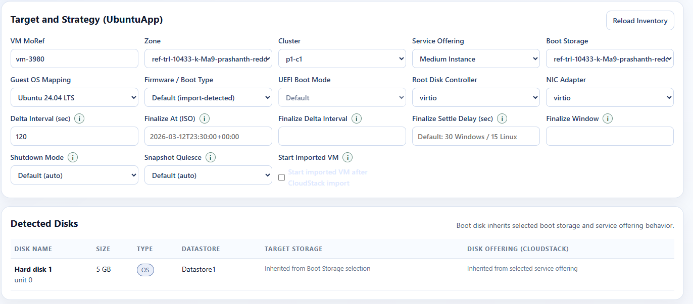
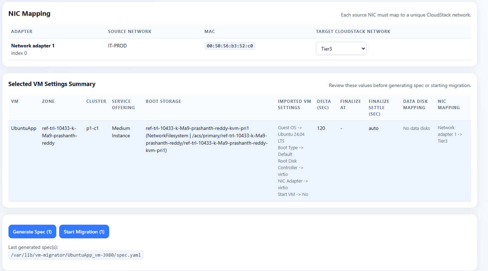
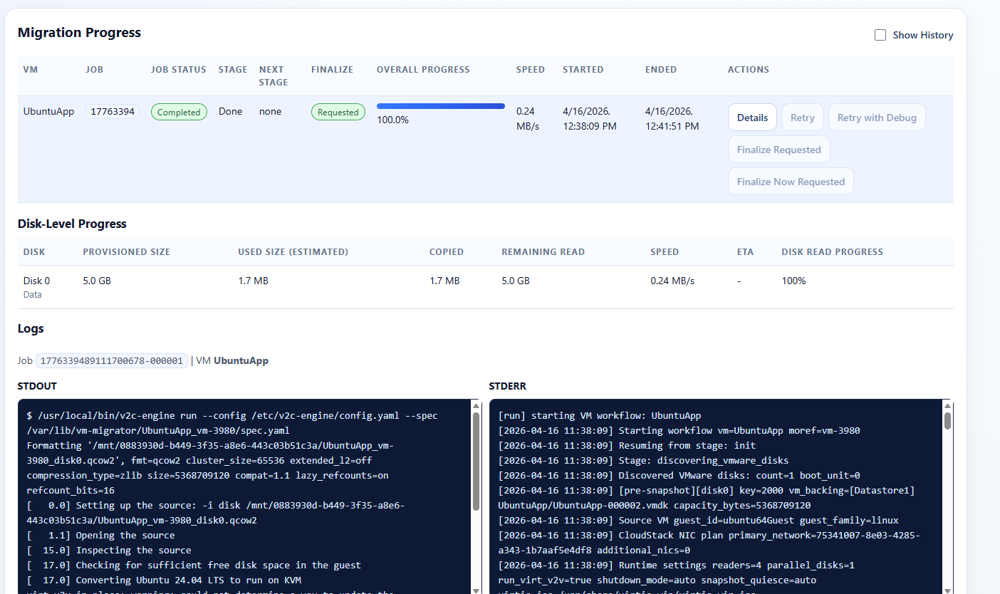
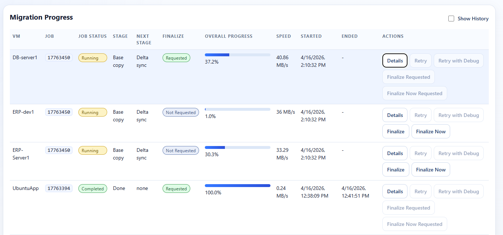
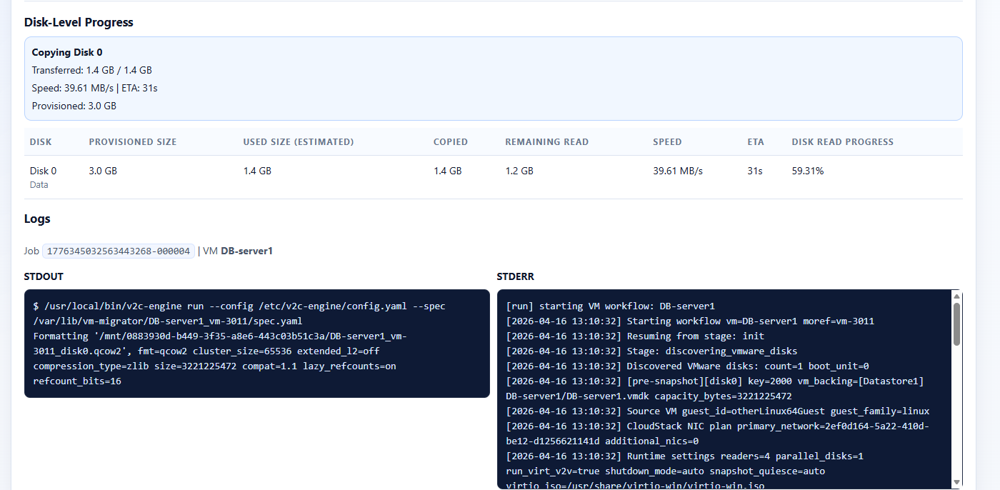

# VMware to CloudStack Migrator

Production-focused warm migration tooling for VMware to Apache CloudStack.

This repository contains:

- a Go migration engine
- an HTTP API service
- a web UI for batch migration planning and monitoring

The project is designed around near-live migration:

- copy the base image once
- keep the target updated with CBT-driven delta rounds
- cut over only for the final sync and import boundary

## What It Does

For each VM, the engine:

1. Connects to vCenter and discovers the source VM, disks, and NICs.
2. Ensures VMware CBT is enabled.
3. Creates a base snapshot.
4. Copies VMware disks directly into QCOW2 on CloudStack primary storage.
5. Runs repeated CBT-native delta rounds.
6. At finalize time, powers off or waits for shutdown according to policy.
7. Runs a final delta sync.
8. Optionally runs `virt-v2v-in-place`.
9. Imports the root disk into CloudStack, then imports and attaches data disks and NICs.

The source VM downtime is therefore limited to the final shutdown + final sync + import window, not the full disk copy time.

## Highlights

- Warm migration using VMware CBT (`QueryChangedDiskAreas`)
- Direct QCOW2 target writes, no RAW intermediate
- Parallel VM and parallel disk execution
- Resume-safe workflow with per-VM state under `/var/lib/vm-migrator`
- Optional `virt-v2v-in-place`
- Multi-disk aware import and conversion planning
- UI, API, and CLI control for `Finalize` / `Finalize Now`
- Pending-action workflow for shutdown decisions when VMware Tools are unavailable
- Retry failed jobs from the UI or API
- Retry failed conversions with `virt-v2v` debug enabled
- CloudStack primary storage support for:
  - NFS
  - Shared Mountpoint

## Screenshots

### Environment Profiles

Use saved vCenter and CloudStack profiles to switch quickly between environments.



### VM Selection

Select one or more source VMs, then choose which VM is currently active for editing.



### Target and Strategy

Choose CloudStack placement, guest mapping, boot/storage behavior, and migration strategy settings such as finalize schedule, shutdown mode, and snapshot quiesce.



### NIC Mapping and Review Summary

Review NIC mappings and the generated per-VM summary before generating specs or starting migration.



### Progress Overview

The Progress view shows job status, current stage, next stage, finalize state, throughput, and quick actions like retry, finalize, and finalize-now.



### Progress Details

Each job can be expanded to show disk progress and the live stdout/stderr logs from the engine.



### Disk Progress and Logs

Disk-level read progress, estimated used size, throughput, and logs help diagnose whether a migration is copying, converting, waiting on VMware, or blocked on a later stage.



## Architecture Summary

- Source read path: VMware VDDK
- Base copy path: VDDK -> QCOW2
- Delta path: VMware CBT ranges -> targeted QCOW2 updates
- Conversion path: optional `virt-v2v-in-place`
- Import path:
  - `importVm` for root disk
  - `importVolume` for additional data disks
  - `attachVolume` for imported data disks

The engine persists workflow state and disk progress to:

- `/var/lib/vm-migrator/<vm>_<moref>/state.json`

Control markers and logs also live in that same runtime directory.

## Current Workflow Stages

The UI/API can now surface early stages before copy begins:

- `connecting_vcenter`
- `finding_vm`
- `discovering_vmware_disks`
- `preparing_target_storage`
- `enabling_cbt`
- `creating_base_snapshot`
- `base_copy`
- `delta`
- `awaiting_shutdown_action`
- `final_sync`
- `converting`
- `import_root_disk`
- `import_data_disk`
- `done`

This helps distinguish “not started copying yet” from “slow copy”.

## Supported Storage

This release supports:

- NFS primary storage
- Shared Mountpoint primary storage

### NFS

- The engine mounts the pool path when needed.
- On Ubuntu, engine-managed mounts default to NFSv3-style options to avoid QCOW2 flush issues observed on some NFSv4 environments.
- You can override mount options with:
  - `V2C_NFS_MOUNT_OPTS`

### Shared Mountpoint

- The engine uses the CloudStack path directly.
- No mount or unmount is attempted by the engine.
- Preflight validation checks:
  - path exists
  - path is a directory
  - path is writable
  - write/delete works
  - free-space check where possible

### Not Supported in Current `main`

- Ceph/RBD import flow is not enabled here because current CloudStack `importVm` support is not sufficient for that path.

## Prerequisites

- Linux host
- VMware VDDK installed
  - must include `include/vixDiskLib.h`
  - must include `lib64/libvixDiskLib.so*`
  - official download: [Broadcom VDDK](https://developer.broadcom.com/sdks/vmware-virtual-disk-development-kit-vddk/latest/)
- Root or sudo access
- vCenter credentials
- CloudStack API access
- Network connectivity from migration host to VMware and CloudStack endpoints

This repository does not redistribute VDDK. Users must obtain it directly from Broadcom and accept Broadcom licensing separately.

## Windows Conversion Requirements

For Windows conversions, `virt-v2v-in-place` needs virtio driver assets available through `VIRTIO_WIN`.

This project resolves them from:

- `virt.virtio_iso`
- `/usr/share/virtio-win/virtio-win.iso`
- `/usr/share/virtio-win`

Bootstrap prepares this automatically:

- EL-family hosts:
  - adds the `virtio-win` repo
  - installs `virtio-win`
  - installs `ntfs-3g`/FUSE packages and adds `fuse-libs` to the libguestfs supermin package list when needed
- Ubuntu hosts:
  - converts upstream `virtio-win.noarch.rpm` with `alien`
  - installs the resulting package
  - extracts `srvany` helpers into `/usr/share/virt-tools`

On Oracle Linux 9 and similar EL9 hosts, Windows inspection can fail with `mount.ntfs: error while loading shared libraries: libfuse.so.2` if the libguestfs appliance does not include `fuse-libs`. Bootstrap now installs the required NTFS/FUSE packages, updates the supermin package list, and clears the cached guestfs appliance so `virt-inspector` can mount NTFS volumes.

## Firewall and Connectivity Requirements

Required access for the current implementation:

- Migration host -> vCenter: `443/TCP`
- Migration host -> ESXi hosts serving source VM disks: `902/TCP` and `443/TCP`
- Migration host -> CloudStack API:
  - `80/TCP`, `8080/TCP`, or `443/TCP` depending on configured endpoint
- Migration host -> NFS primary storage:
  - at least the ports required by your NFS version and mount options
- Browser/admin workstation -> migration host:
  - `5173/TCP` for the UI
  - `8000/TCP` for the API, if used directly

Notes:

- CloudStack management server does not need direct VMware connectivity for this tool.
- `qemu-nbd` is used locally via Unix socket, not as a network listener.

## CloudStack API Timeout

If CloudStack inventory calls such as `listNetworks` or `listOsTypes` are slow in your environment, you can raise the default CloudStack API timeout in `config.yaml`:

```yaml
cloudstack:
  endpoint: "cloudstack.example.com:8080"
  api_key: "replace-me"
  secret_key: "replace-me"
  timeout_seconds: 90
```

This applies to:

- UI/API inventory requests handled by `v2c-engine serve`
- runtime engine calls such as `importVm`, `importVolume`, and `updateVirtualMachine`

After changing it:

```bash
sudo systemctl restart v2c-engine
```

## Quick Start

### 1. Clone

```bash
git clone https://github.com/prashanthr2/vmware-to-cloudstack.git
cd vmware-to-cloudstack
```

### 2. Bootstrap

Before bootstrap, make sure you have either:

- an extracted VDDK directory, or
- a VDDK tarball

Example with extracted VDDK:

```bash
chmod +x ./scripts/bootstrap.sh
sudo ./scripts/bootstrap.sh --vddk-dir /opt/vmware-vddk/vmware-vix-disklib-distrib --install-service --with-ui
```

Example with VDDK tarball:

```bash
chmod +x ./scripts/bootstrap.sh
sudo ./scripts/bootstrap.sh --vddk-tar /tmp/VMware-vix-disklib-*.tar.gz --install-service --with-ui
```

### 3. Configure

```bash
sudo vi /etc/v2c-engine/config.yaml
sudo vi /etc/v2c-ui/.env.local
```

Set the UI API base in `/etc/v2c-ui/.env.local`:

```env
VITE_API_BASE=http://<migration-host-ip>:8000
```

### 4. Start Services

```bash
sudo systemctl enable --now v2c-engine v2c-ui
systemctl status v2c-engine v2c-ui
```

### 5. Open the UI

- UI: `http://<migration-host-ip>:5173`
- Health check: `curl -s http://<migration-host-ip>:8000/health`

## Bootstrap Script Options

Supported options:

- `--vddk-dir <path>`
- `--vddk-tar <path>`
- `--config <path>`
- `--bin-path <path>`
- `--listen <addr>`
- `--ui-listen <addr>`
- `--install-service`
- `--with-ui`
- `--start-services`
- `--skip-build`

Recommended flow:

1. bootstrap without auto-start
2. edit config
3. enable and start services

```bash
sudo ./scripts/bootstrap.sh --vddk-dir /opt/vmware-vddk/vmware-vix-disklib-distrib --install-service --with-ui
sudo vi /etc/v2c-engine/config.yaml
sudo vi /etc/v2c-ui/.env.local
sudo systemctl enable --now v2c-engine v2c-ui
```

Use `--start-services` only when the config files already contain real values.

## Installed Paths

- Engine binary: `/usr/local/bin/v2c-engine`
- Engine config: `/etc/v2c-engine/config.yaml`
- Optional build env helper: `/etc/v2c-engine/build.env`
- UI env file: `/etc/v2c-ui/.env.local`
- Runtime state and logs: `/var/lib/vm-migrator`

Bootstrap intentionally does not install a global `LD_LIBRARY_PATH` profile script because VDDK libraries can interfere with unrelated host tools.

## Migration Strategy Settings

The main behavior is controlled by the `migration:` block in the VM spec.

### Continuous Delta Loop

Use `delta_interval` to keep running incremental rounds before cutover:

```yaml
migration:
  delta_interval: 300
```

Behavior:

- base copy completes first
- engine waits `delta_interval`
- repeated CBT-native delta rounds continue until finalize is requested

### Scheduled Finalize

Use scheduled cutover:

```yaml
migration:
  delta_interval: 300
  finalize_at: "2026-03-12T23:30:00+00:00"
  finalize_delta_interval: 30
  finalize_window: 600
  finalize_settle_seconds: 30
```

Fields:

- `finalize_at`
- `finalize_delta_interval`
- `finalize_window`
- `finalize_settle_seconds`

Default settle delay when omitted or `0`:

- Windows: `30`
- Linux/other: `15`

### Finalize / Finalize Now

Supported from:

- CLI
- API
- UI

`Finalize`:

- requests cutover
- workflow picks it up in normal delta loop

`Finalize Now`:

- interrupts delta wait
- proceeds to finalization as soon as allowed

If the workflow is still in `base_copy`, base copy completes first and then the engine goes directly into finalization.

## Shutdown Behavior

Shutdown policy is controlled by `migration.shutdown_mode`.

Supported values:

- `auto`
- `manual`
- `force`

### `auto`

- If VMware Tools are healthy, the engine uses guest shutdown.
- If VMware Tools are unavailable, the engine pauses and asks for operator action instead of forcing power off immediately.

In that case the UI/API exposes:

- `Force Power Off`
- `Manual Shutdown Done`

The engine will also automatically continue if it observes that the source VM has been powered off manually before the user confirms.

### `manual`

- engine waits for the VM to be powered off externally
- no forced shutdown is attempted

### `force`

- engine force powers off the source VM at finalize time

## Snapshot Quiesce Behavior

Snapshot quiesce policy is controlled by `migration.snapshot_quiesce`.

Supported values:

- `auto`
- `true`
- `false`

Behavior:

- `auto`
  - tries quiesced snapshot when VMware Tools are healthy
  - falls back to non-quiesced when tools are unavailable or quiesce cannot be used
- `true`
  - requests quiesced snapshots
- `false`
  - always uses non-quiesced snapshots

## `virt-v2v-in-place` Behavior

`virt-v2v-in-place` runs after final sync when enabled.

Planning behavior:

- single-disk guests use boot-disk-only mode
- multi-disk guests are inspected and may use temporary `libvirtxml` mode when the guest OS spans multiple disks

Safety improvements in current `main`:

- single-disk conversion fails early if boot-disk inspection finds no guest OS or no root device
- Windows guests get stricter pre-conversion checks
- failed jobs can be retried with `virt-v2v` debug enabled

## Retry and Retry with Debug

Failed jobs can be retried from:

- UI
- API

Standard retry:

- creates a new job
- keeps job history

Debug retry:

- runs `virt-v2v-in-place` with `-v -x`
- useful when conversion failures need upstream-quality diagnostics

API examples:

```bash
POST /migration/retry/{vm}
POST /migration/retry/{vm}?debug=true
```

## UI and API

The UI is served by `v2c-ui` and talks to `v2c-engine serve`.

### API Endpoints

- `GET /health`
- `GET /vmware/vms`
- `GET /cloudstack/zones`
- `GET /cloudstack/clusters`
- `GET /cloudstack/storage`
- `GET /cloudstack/networks`
- `GET /cloudstack/diskofferings`
- `GET /cloudstack/serviceofferings`
- `POST /migration/spec`
- `POST /migration/start`
- `GET /migration/jobs`
- `GET /migration/status/{vm}`
- `GET /migration/logs/{vm}`
- `POST /migration/finalize/{vm}`
- `POST /migration/finalize/{vm}?now=true`
- `POST /migration/retry/{vm}`
- `POST /migration/retry/{vm}?debug=true`
- `POST /migration/shutdown/{vm}?action=force`
- `POST /migration/shutdown/{vm}?action=manual`

### Status Payload Highlights

- `stage`
- `next_stage`
- `overall_progress`
- `transfer_speed_mbps`
- `disk_progress`
- `finalize_requested`
- `finalize_now_requested`
- `awaiting_user_action`
- `required_action`
- `available_actions`

### UI Highlights

- batch VM selection
- per-VM storage and NIC mapping
- strategy settings including:
  - delta interval
  - finalize schedule
  - settle delay
  - shutdown mode
  - snapshot quiesce
- migration progress table
- pending actions panel
- failed-job retry and retry-with-debug
- logs view

## Import Sequence

The import order is:

1. optional `virt-v2v-in-place`
2. `importVm` for root disk
3. attach additional NICs
4. `importVolume` for each non-root disk
5. `attachVolume` for each imported data disk
6. `updateVirtualMachine` for VM-level settings
7. optional start of imported VM

## Manual CLI Usage

Run:

```bash
./v2c-engine run --spec ./examples/spec.run.single-vm.single-disk.single-nic.yaml --config /etc/v2c-engine/config.yaml
```

Status:

```bash
./v2c-engine status --spec ./examples/spec.run.multi.example.yaml --config /etc/v2c-engine/config.yaml
./v2c-engine status --spec ./examples/spec.run.multi.example.yaml --vm Centos7 --json --config /etc/v2c-engine/config.yaml
```

Finalize:

```bash
./v2c-engine finalize --spec ./examples/spec.run.multi.example.yaml --vm Centos7 --config /etc/v2c-engine/config.yaml
./v2c-engine finalize --spec ./examples/spec.run.multi.example.yaml --vm Centos7 --now --config /etc/v2c-engine/config.yaml
```

Serve API:

```bash
./v2c-engine serve --config ./config.yaml --listen :8000
```

## Example Files

See [examples/README.md](./examples/README.md).

Common templates:

- [examples/config.full.example.yaml](./examples/config.full.example.yaml)
- [examples/spec.run.single-vm.single-disk.single-nic.yaml](./examples/spec.run.single-vm.single-disk.single-nic.yaml)
- [examples/spec.run.single-vm.multi-disk.multi-nic.yaml](./examples/spec.run.single-vm.multi-disk.multi-nic.yaml)
- [examples/spec.run.single-vm.defaults-only.yaml](./examples/spec.run.single-vm.defaults-only.yaml)
- [examples/spec.run.multi-vm.single-disk.single-nic.yaml](./examples/spec.run.multi-vm.single-disk.single-nic.yaml)
- [examples/spec.run.multi-vm.multi-disk.multi-nic.yaml](./examples/spec.run.multi-vm.multi-disk.multi-nic.yaml)
- [examples/spec.run.multi-vm.defaults-only.yaml](./examples/spec.run.multi-vm.defaults-only.yaml)

## Known Issues and Workarounds

Known limitations and platform-specific workarounds are tracked in:

- [docs/KNOWN_ISSUES.md](./docs/KNOWN_ISSUES.md)

Current documented issues include:

- Ubuntu + some NFSv4 environments causing QCOW2 flush I/O errors
- `virt-v2v-in-place` failures for CentOS 7 XFS v4 guests on EL10 guestfs stacks

## Manual Build

```bash
go build -o v2c-engine ./cmd/v2c-engine
```

If VDDK is in a non-default path:

```bash
export CGO_CFLAGS="-I/opt/vmware-vddk/include"
export CGO_LDFLAGS="-L/opt/vmware-vddk/lib64 -lvixDiskLib -ldl -lpthread"
```

## Uninstall / Reset

```bash
chmod +x ./scripts/uninstall.sh
sudo ./scripts/uninstall.sh --purge-state
```

To print the bootstrap package list for manual review:

```bash
./scripts/uninstall.sh --list-packages
```

## Expert-Only Commands

`base-copy` and `delta-sync` are hidden by default.

To enable direct expert usage:

```bash
export V2C_ENABLE_EXPERT_COMMANDS=1
```
